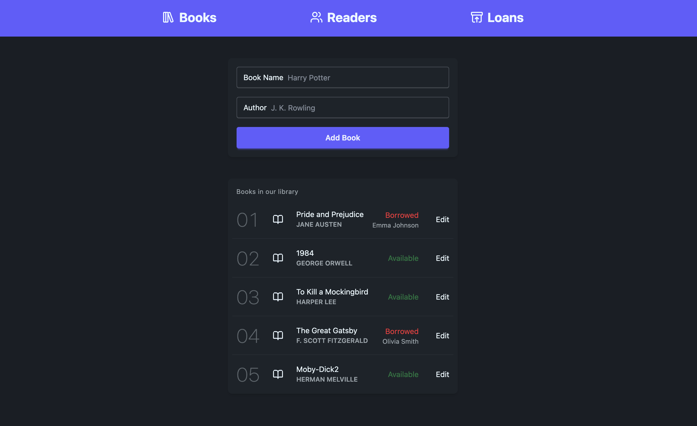
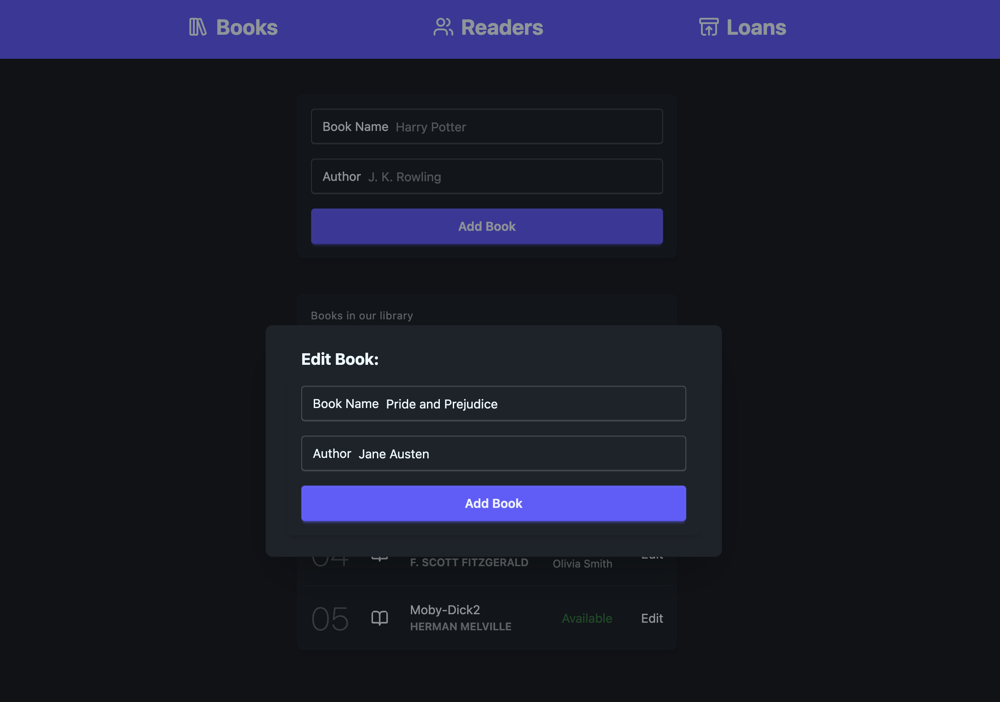
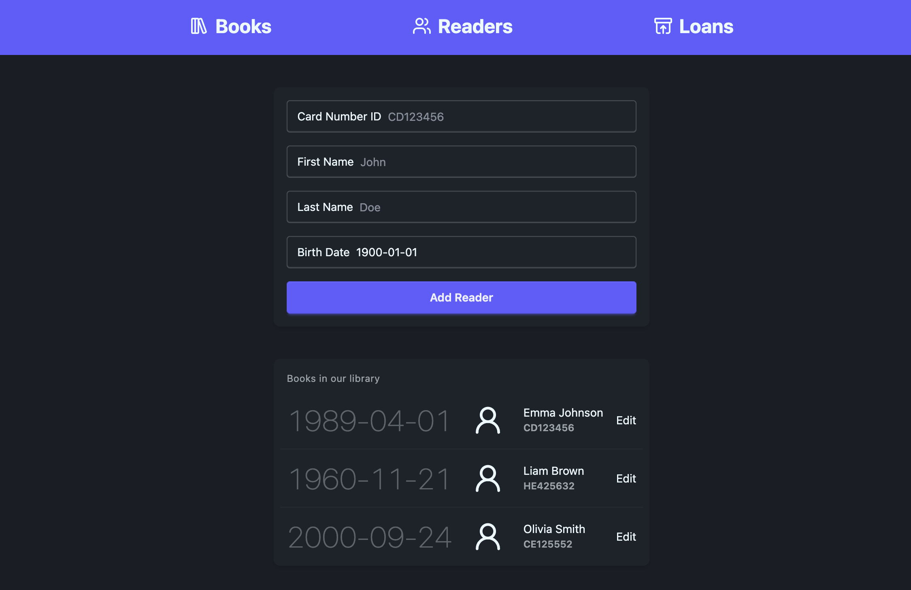
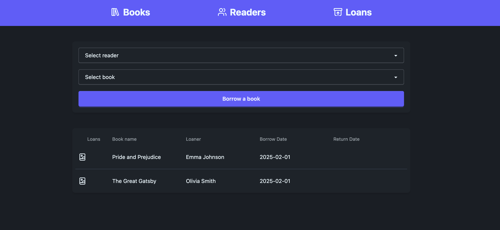

# Library Management Application

This is a **Library Management** application designed to manage books, readers, and loans. It provides the functionality for adding, editing, and viewing books, readers, and loan records. Built with **React** for the frontend and **Node.js** with **Express.js** for the backend, it leverages **Zustand** for state management and **TailwindCSS** for styling. The application uses **MongoDB** for data storage.

---

## Features

### User Functionality

- **Book Management**:

  - Add, edit, and view books.
  - Mark books as borrowed or available.
  - Display the reader who currently has the book borrowed.

- **Reader Management**:

  - Add, edit, and view readers.
  - View detailed information about each reader, including their personal details.

- **Loan Management**:
  - Track the loan and return dates for each book.
  - Mark books as borrowed or returned.
  - Update loan status automatically when a book is returned.

### State Management

- **Zustand**: Used for global state management to manage the lists of books, readers, and loans.

### Data Fetching

- **Axios**: Used for making API calls to fetch and update data between the frontend and backend.

### Styling

- **TailwindCSS**: A utility-first CSS framework used for styling the application, ensuring a responsive and modern design.

### Database

- **MongoDB**: The application uses MongoDB to store books, readers, and loan records. MongoDB is a NoSQL database that allows flexible and scalable data storage.

### Backend

- **Node.js & Express.js**: Server-side runtime environment and framework for creating RESTful API routes.
- **MongoDB**: Used as the primary database to store application data.
- **Mongoose**: A MongoDB ODM (Object Document Mapper) used to interact with MongoDB from the Node.js backend.

---

## Screenshots

### Book Management



### Edit Book



### Reader Management



### Loan Management



---

## Technologies Used

### Backend

- **Node.js**: JavaScript runtime for building the backend.
- **Express.js**: Framework to build the backend API.
- **Axios**: For making HTTP requests to the backend API.
- **MongoDB**: NoSQL database for storing books, readers, and loan records.
- **Mongoose**: ODM for MongoDB to manage data and interact with the database.

### Frontend

- **React.js**: JavaScript library for building the user interface.
- **Zustand**: A small, fast state management library.
- **TailwindCSS**: A utility-first CSS framework for styling.
- **Axios**: For making HTTP requests to interact with the backend API.

---

## How to Use

1. Clone the repository:
   ```bash
   git clone <repository-url>
   ```
